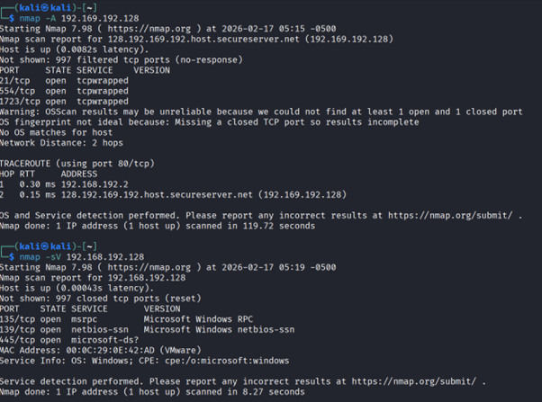
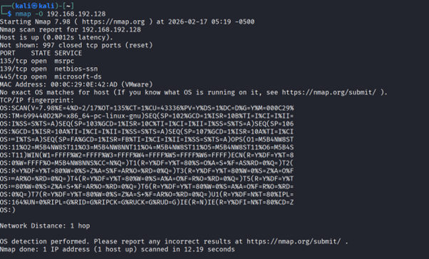

# Nmap Network Scanning Lab

## Objective

The objective of this project is to perform network discovery, port scanning, service detection, and operating system identification using Nmap in a controlled virtual lab environment.

---

## Lab Environment

Attacker Machine: Kali Linux  
Target Machine: Windows 11  
Additional System: Windows Server 2019  
Network: Host-only virtual network  

---

## Tools Used

- Nmap
- Kali Linux
- VMware Virtual Machines

---

## Network Discovery

Command Used:

nmap -sn 192.168.192.128

Purpose:

This command checks whether the host is alive without performing a port scan.

---

## ARP Ping Scan

Command Used:

nmap -sn -PR 192.168.192.128

Purpose:

Uses ARP requests to identify live hosts on the local network.

---

## UDP Ping Scan

Command Used:

nmap -sn -PU 192.168.192.128

Purpose:

Uses UDP packets to detect whether the host is active.

---

## ICMP Echo Ping Scan

Command Used:

nmap -sn -PE 192.168.192.128

Purpose:

Sends ICMP echo requests to determine host availability.

---

## Timestamp Ping Scan

Command Used:

nmap -sn -PP 192.168.192.128

Purpose:

Uses ICMP timestamp requests when echo requests are blocked.

---

## Port Scanning

### Single Port Scan

Command:

nmap -p 21 192.168.192.128

### Multiple Port Scan

Command:

nmap -p 21,80,389 192.168.192.128

### Port Range Scan

Command:

nmap -p 1-1000 192.168.192.128

### Full Port Scan

Command:

nmap -p- 192.168.192.128

Purpose:

Identifies open ports on the target machine.

---

## TCP Connect Scan

Command:

nmap -sT 192.168.192.128

Purpose:

Performs a full TCP connection scan to detect open ports.

---

## UDP Scan

Command:

nmap -sU 192.168.192.128

Purpose:

Identifies open UDP ports.

---

## Service Version Detection

Command:

nmap -sV 192.168.192.128

Purpose:

Detects versions of services running on open ports.

---

## Operating System Detection

Command:

nmap -O 192.168.192.128

Purpose:

Attempts to identify the target operating system.

---

## Aggressive Scan

Command:

nmap -A 192.168.192.128

Purpose:

Performs OS detection, version detection, script scanning, and traceroute.

---

## MAC Address Spoofing

Command:

nmap --spoof-mac 0 192.168.192.128

Purpose:

Spoofs the MAC address to appear as a different device.

---
## Screanshots

## Network Discovery

## Port Scanning

## Aggressive Scan

## Results Summary

The scans successfully identified:

- Live host detection
- Open ports (135, 139, 445)
- Microsoft services running on the target
- Network distance and latency
- MAC address vendor information

The lab demonstrated how attackers and security professionals enumerate network services to identify potential attack surfaces.

---

## Learning Outcomes

- Understanding different Nmap scan types
- Network reconnaissance techniques
- Service and OS fingerprinting
- Importance of exposed services in cybersecurity

---

## Disclaimer

This project was performed in a controlled lab environment for educational and ethical purposes only.
